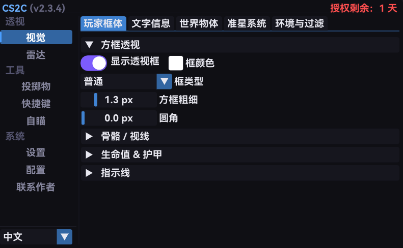
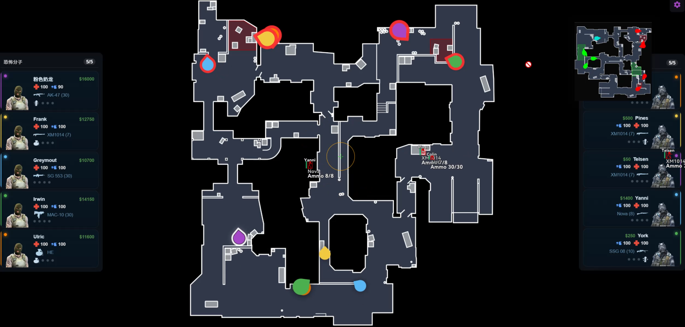

**English** | **[中文](README_CN.md)**

# CS2-DMA


An external CS2 (Counter-Strike 2) tool built with C++, using DMA (Direct Memory Access) hardware to read game memory via FPGA devices and render ESP, radar, grenade helper, and more on a separate machine. The open-source version is read-only DMA and does not include any aim-assist-related features.


> ⭐ If you like this project, please give it a Star to support the author's continued updates!
> Join QQ group: 965428002 for the latest updates and help.

> **Full Version** (includes Hand Follow, Aim Assist, Recoil Data Processing, etc., via KMBox hardware): [Sponsor Now](https://shop.95fk.net/shop/OJ3QCIOK)

---

## Features

### Visuals / ESP

- **Box ESP** - Normal / Dynamic / Rounded / Corner styles with fill, rounding, and thickness options
- **Bone ESP** - Full skeleton rendering
- **Health Bar / Armor Bar** - Horizontal or vertical, with damage fallback animation
- **Bar Value Labels** - Numeric health/armor values displayed beside the bars
- **Weapon ESP** - Displays currently held weapon name
- **Weapon Icon ESP** - Weapon icons rendered using the weapons.ttf glyph font (with option to hide knife icons)
- **Weapon Ammo ESP** - Displays ammo count (XX/YY) with low-ammo warning color
- **Distance ESP** - Shows distance to enemies
- **Player Name** - Displays player nicknames
- **Eye Ray** - Shows enemy view direction
- **Snaplines** - Lines from screen top/center/bottom to enemies
- **Head Dot** - Head position marker
- **Text Outline** - Global 8-direction stroke for all ESP text, configurable color and thickness
- **Safe Zone** - Crosshair area ESP cutout (circle/square, mask/skip mode, per-element skip) to reduce visual clutter
- **Spectator List** - Detect who is spectating you, show spectator name, team color, and spectate mode ([Eye]/[Chase]/[Roam])
- **ESP Preview** - Preview window with single-color (1 fake player) and tri-color (Default/Visible/Hidden) modes to visualize all ESP elements without entering a match
- **Sound ESP** - Ripple animation at enemy position when they fire weapons
- **Footstep ESP** - Movement pulse circle at enemy position (excludes silent walk)
- **Player Flags** - Status indicators above enemies: Blind / Scoped / Defusing / Kit / Money
- **World Projectile Timers** - World-space countdown timers for active smokes, infernos (molotovs), and decoys with independent toggles
- **Dropped Weapon ESP** - Displays names and icons of weapons dropped on the ground, filterable by weapon category
- **Bomb Timer Overlay** - Draggable on-screen C4 countdown window with defuse progress bar and kit detection
- **Visibility Coloring** - VPK map geometry BVH ray occlusion check, two-color ESP based on visibility (visible vs hidden behind walls)



### Crosshair Overlay

- 4 crosshair styles: Cross / Dot / Circle / Cross+Dot
- Adjustable arm length, thickness, gap, and color
- Enemy color change: crosshair turns custom color when aiming at an enemy
- Crosshair Safe Zone integration

### Bomb ESP

- Planted / Carried / Dropped / Defusing status display
- Explosion and defuse countdown timers


### Projectile ESP

- Real-time display of in-flight flashbangs, smokes, HE grenades, molotovs, and decoys
- Explosion/effect radius circle rendering


### Web Radar (Full Version only)

- Built-in WebSocket server (default port 22006, configurable in menu)
- Frontend assets embedded into cs2.exe - single-file deployment, no extra files
- Three-tier transport fallback: WebSocket -> SSE -> HTTP polling
- **LAN Access** - Toggle Web Radar in the menu, then any LAN device can view real-time radar via browser (menu shows local IP + one-click copy URL)
- **Public Access (built-in Cloudflare Tunnel)** - One-click start/stop cloudflared quick tunnel from the menu, auto-captures public URL (requires cloudflared installed: `winget install Cloudflare.cloudflared`); ngrok / frp / router port forwarding also supported
- **DMA Health State Machine** - Three-state monitor (Healthy / Degraded / Failed) tracking DMA read success/failure streaks with automatic recovery
- **VT/IOMMU Rejection Detection** - Detects suspected VT/IOMMU blocking after 3 consecutive Full refresh failures and alerts the user
- **RTT Monitor** - /api/ping endpoint + frontend latency indicator with 3-state status (connecting/live/error)
- **Page Update Auto-Reload** - Pushes pageUpdate event to clients for automatic browser refresh when resources change
- **Origin Allowlist** - CORS control to restrict allowed source domains for /api/* endpoints
- **Password Authentication** - Optional WebSocket URL query parameter (?password=xxx) for access protection
- **Per-Map Radar Calibration** - Adjustable rotation, scale, and X/Y offset per map with auto-save
- **Runtime Stats Panel** - Real-time statistics: send frequency, client count, frames sent/dropped, coalesced frames, payload bytes, bytes/sec
- **Team Panel** - Frontend T/CT player cards with character model images, weapon icons, ammo, and utility slots
- **Spectator Panel** - Frontend spectator list with team-colored borders
- **Advisory Indicators** - Frontend status hints: planting / defusing / sole survivor
- **Bomb Escape Arrow** - Frontend directional arrow showing escape route from bomb explosion radius when planted
- **QR Code** - In-menu QR code for quick mobile access to the radar URL



### Grenade Helper

- Per-map preset throw positions (JSON format)
- Real-time direction arrow + distance indicator
- Record / edit / delete custom positions
- Supports flash, smoke, HE, and molotov types


### Hotkeys

- 26 customizable key bindings (Full Version) / 14 (open-source) covering ESP, Web Radar, aim-assist, and feature toggles
- Dual-source key detection: DMA (target machine) + `GetAsyncKeyState` (local machine)
- Persistent config save/load

### DMA Low-Latency Optimization

- **Scatter Batch Reads** - All entity data is merged into a single DMA operation, eliminating per-read PCIe round-trip latency
- **On-Demand Reading** - Only reads fields required by currently enabled features; the entire data pipeline sleeps when no features are active - zero wasted transfers
- **Tiered Entity Caching** - High-frequency data (position, health) is read every frame; low-frequency data (name, team) updates at 5/50 frame intervals, reducing 80%+ redundant reads
- **Zero-Copy Snapshot** - Double buffer + atomic pointer swap; writer holds lock only briefly, render thread reads without blocking - data latency < 1 frame, say goodbye to flickering boxes
- **Bone Reliability Check** - Validates bone data sanity and caches last reliable skeleton for 150ms to suppress flickering
- **Snapshot Interpolation** - Quintic ease smoothing + velocity extrapolation for player positions, eliminating stutter between DMA frames
- **CameraWorker Thread** - Dedicated 500Hz background thread for view matrix reads, decoupled from render loop to eliminate mouse-look stutter

### Performance Monitor & Stability

- **Performance Monitor** - On-screen overlay: FPS (color-coded), frame time, entity count, grenade count, spectator count
- **Debug Stats Overlay** - Detailed 7-stage timing (matrix/local/entities/scatter/weapon/bomb/projectile) plus WebRadar statistics overlay
- **Player Count Health Check** - Detects when read player count drops below expected and auto-triggers DMA repair
- **Tiered DMA Refresh** - Progressive recovery: Probe (100 failures) -> Repair (300) -> Full (500) with address re-init and cache reset
- **Adaptive Shard Discovery** - Dynamically splits entity list scanning into 1/2/4/10 shards based on entity count for optimal throughput
- **Data Reliability Tolerance** - Multiple grace periods (core stale hold, zero-pawn grace, hierarchy missing hold, controller missing hold, death confirm) to tolerate DMA jitter without flickering
- **Extreme Stability** - Due to the nature of DMA transfers, dirty data is unavoidable. This project focuses on optimizing data validation and reliability - no flickering boxes, no missed players

### Other

- **Config System** - Create / save / load / delete multiple configs, auto-loads `_autosave.config` on startup
- **Auto Update Check** - Compares local version against GitHub Releases on startup; offers to redirect to download page if newer version available
- **DMA Offset Update** - Automatically runs cs2-dumper in DMA mode to extract offsets when game update detected, replacing the online comparison approach
- **Game Version Check** - Queries Steam API for latest CS2 news timestamp and compares with local offset date to detect outdated offsets
- **System Proxy Auto-Detection** - Automatically detects and uses system proxy (manual/PAC/WPAD) for GitHub and Steam API connections, helpful for users behind firewalls
- **Multi-Monitor Support** - Enumerate all displays; select target monitor for overlay rendering with auto-positioned window
- **Render Resolution** - Resolution presets (4:3, 16:9, 16:10) or auto-detect; DPI-aware rendering
- **Debug Log Toggle** - Runtime switch for TRACE/DEBUG level logs; zero overhead when disabled
- **Multi-language** - Auto-detects system language via `GetUserDefaultUILanguage()` (Chinese for Chinese systems, English for others); manual toggle available
- **Logging System** - Leveled logging (TRACE -> FATAL) with ring buffer for crash diagnostics
- **Crash Handler** - SEH + `std::terminate` capture, auto-generates `.log` + `.dmp` with recent logs, feature state, and system info
- **Troubleshoot Tool** - `tools/troubleshoot.bat` provides a bilingual 8-item menu: full diagnosis / DMA hardware check / dependency files / config files / port conflicts / log analysis / diagnostic report / one-click auto-fix
- **Encryption & Decryption** - Supports CR3 (DTB) repair and automatically enables when encryption is detected
- **VTD** - Not recommended to enable. Although DMA read frequency has been optimized, it may still be detected
- **Platform Availability** - Works on major competitive platforms, but please do not use in real player matches

---

## Quick Start

### Download

Go to the [Releases](https://github.com/chao-shushu/CS2-DMA/releases) page and download the latest `CS2-DMA-Release.zip`.

### Directory Structure After Extraction

```
CS2-DMA/
├── cs2.exe              # Main executable
├── vmm.dll              # MemProcFS core library
├── leechcore.dll        # LeechCore device communication
├── FTD3XX.dll           # FTDI USB3 driver
├── data/
│   ├── offsets.json     # Game offsets
│   ├── client_dll.json  # client.dll offsets
│   └── grenade-helper/  # Grenade helper map data
├── saved/configs/       # Config storage (auto-generated)
└── logs/                # Log directory (auto-generated)
```

### How to Run

1. **Connect FPGA device** - Ensure your DMA hardware is properly connected to the secondary machine
2. **Launch CS2 on the main machine** - Open the game and join a match
3. **Run `cs2.exe` on the secondary machine** - The program will automatically:
   - Initialize DMA connection
   - Search for the `cs2.exe` process
   - Start rendering ESP once the game is detected
4. **Press `F8` to open the menu** - Toggle features on/off from the menu

### Menu Tabs

| Tab | Description |
|-----|-------------|
| **Visuals** | Box, bone, health bar, armor bar, weapon, weapon icon, ammo, distance, name, eye ray, snaplines, head dot, spectator list, player flags, visibility coloring, sound/footstep ESP, world projectile timers, dropped weapons, bomb timer, crosshair overlay, safe zone, team filter |
| **Radar** (Full Version) | Web Radar toggle, port, broadcast interval, LAN URL display & copy, Cloudflare tunnel one-click start/stop, QR code, radar calibration (rotation/scale/offset), password auth, Origin allowlist, runtime stats |
| **Grenade** | Grenade helper toggle, record positions, edit/delete, per-map presets |
| **Hotkeys** | 26 customizable key bindings (Full Version) / 14 (open-source) - ESP toggles, feature toggles, aim-assist toggles, reload game |
| **Settings** | Frame rate limit, VSync, render quality, monitor selection, resolution, menu hotkey, performance monitor, debug stats, debug log, player count health check, offset update, help button |
| **Config** | Create, save, load, delete config files |
| **Contact** | Contact author, join QQ group |
| **Aimbot** (Full Version) | Hand Follow, aim assist, target response, tracking, recoil data processing, FOV circle, per-weapon configs |

### Offsets Outdated?

After each CS2 update, game offsets may become invalid, causing ESP to not display or show incorrect data. To fix:

1. The program can automatically detect game updates and run cs2-dumper in DMA mode to extract new offsets
2. Alternatively, get the latest `offsets.json` and `client_dll.json` from [cs2-dumper](https://github.com/a2x/cs2-dumper) and replace the files in the `data/` directory
3. You can also use `tools/update-offsets.bat` to update manually (supports local and DMA modes)
4. Restart the program

### Hotkeys

| Key | Function |
|-----|----------|
| `F8` | Show / Hide menu |
| `F5` (default, customizable) | Record grenade position |

> Key detection supports dual sources: DMA reads the target machine's keyboard state, and `GetAsyncKeyState` reads the local machine's keyboard. Custom hotkeys can be configured in the Hotkeys tab.

---

## Full Version

The open-source version is read-only DMA. The following features are included in the **Full Version** (implemented via KMBox and similar hardware, not open-sourced) - feature descriptions only:

- **Hand Follow (Speed Replicator)** - The correction speed equals your hand speed, 1:1 replication, never faster than your hand; direction is auto-calibrated every frame by the software - drift is corrected back toward the target, with a weak baseline assist when locked
- **Aim Assist** - FOV circle / smoothing / bone selection (Head/Neck/Chest/Pelvis) / visibility check / bone fallback / target switch delay / 8 weapon-class specific configs
- **Target Response Assist** - Auto-fire (always/hold mode, delay, jitter, hold duration)
- **Tracking Assist** - Magnetic tracking assist (pure auto or hold, FOV, smoothing, 8 weapon-class specific configs)
- **Recoil Data Processing** - Auto recoil compensation (predicted landing point visualization, intensity auto-calculated from sensitivity)
- **Velocity Prediction** - Lead based on player velocity
- **Hardware Device Support** - KMBox NET / KMBox NET+ / KMBox B Pro / MAKCU
- **Preset System** - Safe / Competitive / Stealth one-click presets
- **FOV Circle & Predicted Landing Point On-Screen Visualization**
- **Web Radar (Data Panel)** - Real-time radar viewable in any browser on LAN or public network, shareable with teammates/friends, per-map calibration, password protection, QR code access

> **Get the Full Version**: [Sponsor Now](https://shop.95fk.net/shop/OJ3QCIOK)
>
> For questions, join QQ group **965428002**.

---

## Bug Reports

Found an issue? Please submit a bug report via [GitHub Issues](https://github.com/chao-shushu/CS2-DMA/issues).

### What to Include in Your Issue

1. **Problem description** - Briefly describe the issue
2. **Steps to reproduce** - How to trigger the bug
3. **Log file** - The latest `.log` file from `logs/`
4. **Crash dump** (if the program crashed) - `crash_*.log` and `crash_*.dmp` files from `logs/`
5. **Environment info**: Windows version (e.g. Win11 24H2), FPGA device model, whether CS2 was recently updated (are offsets up to date?)

> You can also run `tools/troubleshoot.bat` to generate a diagnostic report. Attaching it helps resolve problems much faster.

---

## Credits

- [CS2_DMA_Extrnal](https://github.com/Mzzzj/CS2_DMA_Extrnal) - Initial codebase and inspiration
- [MemProcFS](https://github.com/ufrisk/MemProcFS) - DMA memory access framework
- [cs2-dumper](https://github.com/a2x/cs2-dumper) - Automated offset dumper
- [cs2_webradar](https://github.com/clauadv/cs2_webradar) - Web Radar frontend
- [Dear ImGui](https://github.com/ocornut/imgui) - GUI framework

## License

This project is licensed under the [MIT License](docs/LICENSE).
